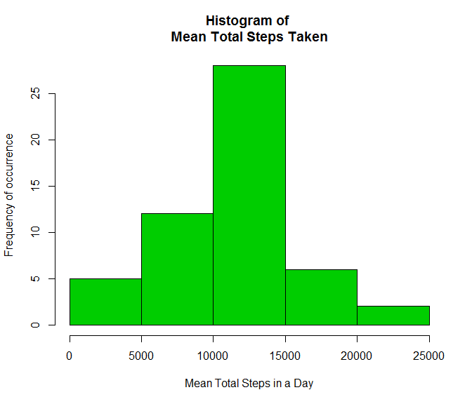
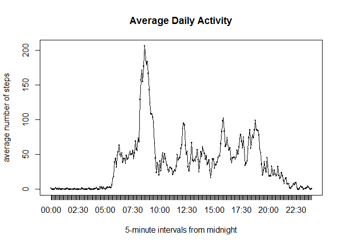
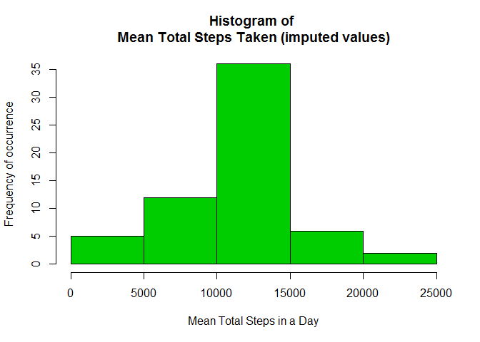
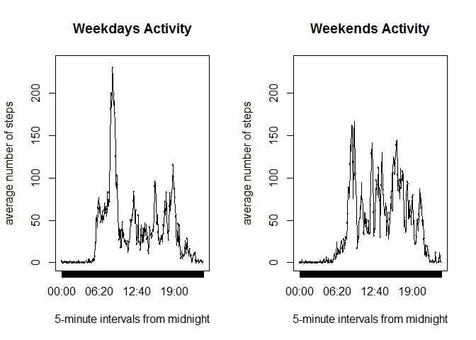

# Reproducible Research: Peer Assessment 1
Terry Scantlebury  
April 4, 2017  


Check for and load libraries necessary for this assignment

```r
if (!require(plyr)) install.packages('plyr')
```

```
## Loading required package: plyr
```

```r
library(plyr)
if (!require(dplyr)) install.packages('dplyr')
```

```
## Loading required package: dplyr
```

```
## 
## Attaching package: 'dplyr'
```

```
## The following objects are masked from 'package:plyr':
## 
##     arrange, count, desc, failwith, id, mutate, rename, summarise,
##     summarize
```

```
## The following objects are masked from 'package:stats':
## 
##     filter, lag
```

```
## The following objects are masked from 'package:base':
## 
##     intersect, setdiff, setequal, union
```

```r
library(dplyr)
```

## Loading and preprocessing the data

This assignment makes use of data from a personal activity monitoring device. This device collects data at 5 minute intervals through out the day. The data consists of two months of data from an anonymous individual collected during the months of October and November, 2012 and include the number of steps taken in 5 minute intervals each day.

The data for this assignment is found at [Activity monitoring data] (https://d396qusza40orc.cloudfront.net/repdata%2Fdata%2Factivity.zip)  
and is also available in the github repository associated with this assignment
submission. The zip file was decompressed into the current working directory 
of the project.  


```r
df <- read.csv("activity.csv")
```

The variables included in this dataset are:

* **steps:** Number of steps taking in a 5-minute interval (missing values are coded as NA)  
* **date:** The date on which the measurement was taken in YYYY-MM-DD format  
* **interval:** Identifier for the 5-minute interval in which measurement was taken

The dataset is stored in a comma-separated-value (CSV) file and there are a total of 17,568 observations in this dataset.

Following is the structure of the loaded data-frame


```r
str(df)
```

```
## 'data.frame':	17568 obs. of  3 variables:
##  $ steps   : int  NA NA NA NA NA NA NA NA NA NA ...
##  $ date    : Factor w/ 61 levels "2012-10-01","2012-10-02",..: 1 1 1 1 1 1 1 1 1 1 ...
##  $ interval: int  0 5 10 15 20 25 30 35 40 45 ...
```

Using the interval identifier, the data-frame was extended to include time as a factor for plotting. The original interval identifier is just the 24 hour clock notation stripped of all formatting and leading zeros. 

### Format interval ID to factor(of time)


```r
i <- paste0("000",df$interval)
dtTime <- substr(i,nchar(i)-3,nchar(i))
dtTime <- paste0(substr(dtTime,1,2),":",substr(dtTime,3,4))
df$time <- as.factor(dtTime)
rm(i,dtTime)
```

## What is mean total number of steps taken per day?

A summary of the data set shows that there are "NA"" values in the steps vector.


```r
summary(df)
```

```
##      steps                date          interval           time      
##  Min.   :  0.00   2012-10-01:  288   Min.   :   0.0   00:00  :   61  
##  1st Qu.:  0.00   2012-10-02:  288   1st Qu.: 588.8   00:05  :   61  
##  Median :  0.00   2012-10-03:  288   Median :1177.5   00:10  :   61  
##  Mean   : 37.38   2012-10-04:  288   Mean   :1177.5   00:15  :   61  
##  3rd Qu.: 12.00   2012-10-05:  288   3rd Qu.:1766.2   00:20  :   61  
##  Max.   :806.00   2012-10-06:  288   Max.   :2355.0   00:25  :   61  
##  NA's   :2304     (Other)   :15840                    (Other):17202
```

For the purpose of the next calculation, these NAs will be ignored. 
We will total the daily steps and display as a histogram showing the frequency distribution of the number of steps taken during the study. 


```r
df1 <- subset(df,!is.na(df$steps))
df.bydate <- ddply(df1, .(date), summarise, total.steps = sum(steps,na.rm = TRUE))
with(df.bydate, hist(total.steps, col = 19, xlab = "Mean Total Steps in a Day", ylab = "Frequency of occurrence", main = "Histogram of \nMean Total Steps Taken"))
```

<!-- -->

Next we calculate the mean and median number of steps taken during the study


```r
df.mean <- mean(df.bydate$total.steps)
df.median <- median(df.bydate$total.steps)
df.mean
```

```
## [1] 10766.19
```

```r
df.median
```

```
## [1] 10765
```

This shows that across the study the daily mean number of steps taken is **10766.19** and the daily median number of steps taken is **10765**.

## What is the average daily activity pattern?

To determine the average daily activity patterns we:-  

* Make a time series plot (i.e. type = "l") of the 5-minute interval (x-axis) and the average number of steps taken, averaged across all days (y-axis)  


```r
df.act <- ddply(df1, .(time), summarise, mean.steps = mean(steps,na.rm = TRUE))
plot(df.act$time,df.act$mean.steps, type = "l", xlab = "5-minute intervals from midnight", ylab = "average number of steps", main = "Average Daily Activity")
lines(df.act$time,df.act$mean.steps)
```

<!-- -->

Next we need to decide  

* Which 5-minute interval, on average across all the days in the dataset, contains the maximum number of steps?  

The following table shows the required time interval and mean steps in the interval  


```r
df.act[which.max(df.act$mean.steps),]
```

```
##      time mean.steps
## 104 08:35   206.1698
```

We find then that the maximum mean number of steps is **206.1698** at time index **08:35**.  

## Imputing missing values

Note that there are a number of days/intervals where there are missing values (coded as NA). The presence of missing days may introduce bias into some calculations or summaries of the data.

The number of missing step values are **2304**

We will impute values for the missing steps data using a strategy of the mean for that 5-minute interval across all days. We will create a new dataset that is equal to the original dataset but with the missing data filled in.


```r
df.im <- df
for (i in 1 : nrow(df.im)) if(is.na(df.im$steps[i])) df.im$steps[i] = df.act[df.act$time==df.im$time[i],"mean.steps"]
```

With this new dataset, we will make a histogram of the total number of steps taken each day and calculate and report the mean and median total number of steps taken per day. 


```r
df.im.bydate <- ddply(df.im, .(date), summarise, total.steps = sum(steps,na.rm = TRUE))
with(df.im.bydate, hist(total.steps, col = 19, xlab = "Mean Total Steps in a Day", ylab = "Frequency of occurrence", main = "Histogram of \nMean Total Steps Taken (imputed values)"))
```

<!-- -->
  
Let us now examine the mean and medium for the data where missing step values were imputed using the total mean average interval strategy. The questions are:-  

* Do these values differ from the estimates from the first part of the assignment?   
* What is the impact of imputing missing data on the estimates of the total daily number of steps?  

The new mean and median values are calculated as follows.


```r
df.im.mean <- mean(df.im.bydate$total.steps)
df.im.median <- median(df.im.bydate$total.steps)
df.im.mean
```

```
## [1] 10766.19
```

```r
df.im.median
```

```
## [1] 10766.19
```

The new mean of **10766.19** and new median of **10766.19** are the same, thus the impact of imputing values with this strategy is to make both values the same.

## Are there differences in activity patterns between weekdays and weekends?
To examine the difference (if any) in activity patters between weekdays and weekends we extend the dataset (with imputed values) to include a factor that determines weekdays or weekends. Then we summarise the activity for the two groups.


```r
# First we identify the weekdays vs. weekends using the day number
for (i in 1 : nrow(df.im)) {
    if(strftime(df.im$date[i],'%u') < "6") 
        df.im$days[i] = "weekdays" else 
            df.im$days[i] = "weekends" }
# Then we convert to a factor
df.im$days <- as.factor(df.im$days)
# Then we make the panel plot
df.wkday <- ddply(df.im, .(days,time), summarise, mean.steps = mean(steps,na.rm = TRUE))
par(mfrow = c(1,2))
plot(df.wkday[df.wkday$day=="weekdays","time"], df.wkday[df.wkday$day=="weekdays","mean.steps"], type = "l", 
     xlab = "5-minute intervals from midnight", 
     ylab = "average number of steps", 
     ylim = c(0,235),
     main = "Weekdays Activity")
lines(df.wkday[df.wkday$day=="weekdays","time"], df.wkday[df.wkday$day=="weekdays","mean.steps"])

plot(df.wkday[df.wkday$day=="weekends","time"], df.wkday[df.wkday$day=="weekends","mean.steps"], type = "l", 
     xlab = "5-minute intervals from midnight", 
     ylab = "average number of steps",
     ylim = c(0,235),
     main = "Weekends Activity")
lines(df.wkday[df.wkday$day=="weekends","time"], df.wkday[df.wkday$day=="weekends","mean.steps"])
```

<!-- -->

A look at the maximum values for these data sets reveals the following  


```r
df.wkday.means <- ddply(df.wkday, .(days), function(x) x[which.max(x$mean.steps),])
df.wkday.means
```

```
##       days  time mean.steps
## 1 weekdays 08:35   230.3782
## 2 weekends 09:15   166.6392
```

This shows that, for the study data, the mean maximum number of step during the week is **230.3782** compared to **166.6392** on the weekend. Further a visual check of the graphs show that the test subject is more active for longer period during the weekends compared to weekdays.
